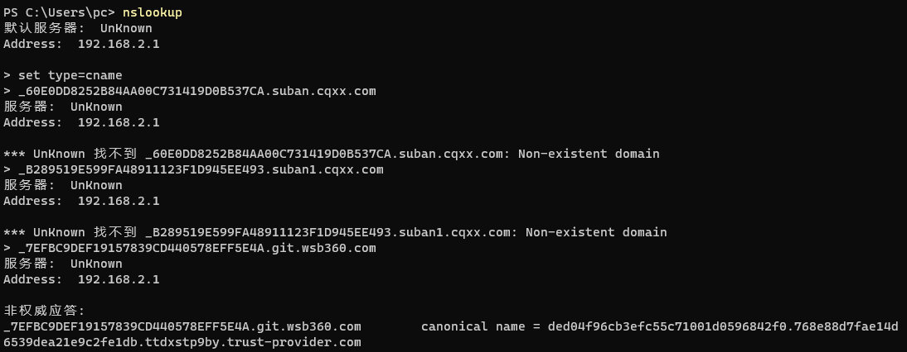

## SSL证书

#### 获取证书

选择Let‘s  Encrypt提供的免费证书

参考官网教程 https://certbot.eff.org/lets-encrypt/centosrhel7-nginx

在root路径下创建.well-known/acme-challenge文件夹

对nginx.conf不做修改

```
yum install certbot python2-certbot-nginx

certbot certonly --webroot -w /var/www/hexo -d www.lizhanxu.com -m 934035362@qq.com --agree-tos
```

得到的证书在/etc/letsencrypt/live/www.lizhanxu.com目录下


修改nginx.conf如下

# Settings for a TLS enabled server.

    server {
        listen       443 ssl http2 default_server;
        listen       [::]:443 ssl http2 default_server;
        server_name  www.lizhanxu.com;//改为自己的域名
        root         /var/www/hexo;//改为网站所在文件夹
    
        ssl_certificate "/etc/letsencrypt/live/www.lizhanxu.com/fullchain.pem";//改为fullchain.pem证书所在位置
        ssl_certificate_key "/etc/letsencrypt/live/www.lizhanxu.com/privkey.pem";//改为privkey.pem证书所在位置
        ssl_session_cache shared:SSL:1m;
        ssl_session_timeout  10m;
        ssl_ciphers HIGH:!aNULL:!MD5;
        ssl_prefer_server_ciphers on;
    
        # Load configuration files for the default server block.
        include /etc/nginx/default.d/*.conf;
    
        location / {
        }
    
        error_page 404 /404.html;
            location = /40x.html {
        }
    
        error_page 500 502 503 504 /50x.html;
            location = /50x.html {
        }
    }

### 判断CNAME是否添加成功

