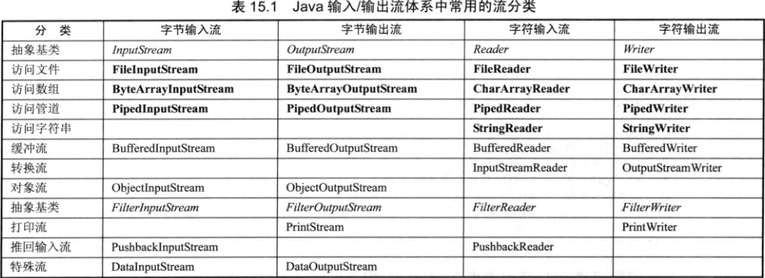

Java中把所有设备里的有序数据抽象成流模型

流中有隐式的记录指针

**在执行close()方法之前，会自动执行输出流的flush()方法**

flush(),将输出缓存中的内容立即输出

Windows平台换行符为'\r\n'，Linux/Unix平台换行符为'\n'

RandomAccessFile 

##不同角度流的分类

###输入流和输出流（按流向）

     输入流、输入流是从程序运行所在的内存的角度来划分的

     输入流以InputStream和Reader作为基类，输出流以OutputStream和Writer作为基类

###字节流和字符流（按数据单元）
     
     字节流和字符流的用法几乎一样，区别在于它们所操作的数据单元不同
     
     字节流操作的数据单元是8位的字节，字符流操作的数据单元是16位的字符（一个字符等于两字节，一个字节是8位）
     
     如果输入输出的内容为文本内容，应该考虑使用字符流；如果输入输出的内容为二进制内容，则应该考虑使用字节流
     
###节点流和处理流（按角色）

####节点流
   ——可以对一个特定的IO设备（磁盘、网络等）读写数据的流，也被称为低级流

     节点流都是直接以物理IO节点作为构造器参数的
     
     访问文件的节点流：FileInputStream、FileReader、FileOutputStream、FileWriter
     
     访问管道的节点流：用于实现进程间的通信
     
####处理流（装饰器设计模式）
   ——用于对一个已经存在的流进行连接和封装，通过封装后的流来实现读写功能，处理流也被称为高级流、包装流
   
     在使用处理流包装了节点流之后，关闭流资源时只需要关闭最上层的处理流即可。关闭最上层的处理流，系统会自动关闭被该处理流包装的节点流

     处理流都是以一个已经存在的流作为构造器参数的
     
     处理流的优势：①操作更简单 ②执行效率更高
 
     常用处理流：过滤流、打印流、缓冲流、对象流、转换流等
     
#####过滤流
    
    过滤流是FilterInputStream、FilterOutputStream、FilterReader、FilterWriter的子类
    
    包括推回输入流、数据流等
     
######打印流——PrintWriter、PrintStream

######推回输入流——PushbackInputStream、PushbackReader

      推回输入流都有一个推回缓冲区，调用unread方法将指定内容推回到推回缓冲区
    
      推回输入流每次调用read方法，都会先从推回缓冲区读取
    
      默认推回缓冲取的大小为1
    
######数据流——DataInputStream、DataOutputStream

      DataInputStream能以一种与机器无关的方式，直接从地从字节输入流读取JAVA基本类型和String类型的数据。
     
#####缓冲流——增加了缓冲功能，提高了输入输出的效率
    
     BufferedReader中readLine()读取一行，非常方便，很常用

#####对象流——用于对象序列化

#####转换流——InputStreamReader、OutputStreamWriter将字节流转换为字符流

###重定向标准输入输出

    通过调用System类中的以下3个方法

    public static void setIn(InputStream in);
    
    public static void setOut(PrintStream out);
    
    public static void setErr(PrintStream err);
     
###

###流的关闭
    在使用处理流包装了节点流之后，关闭流资源时只需要关闭最上层的处理流即可。关闭最上层的处理流，系统会自动关闭被该处理流包装的节点流
    如果流之间有依赖关系，应该按照依赖关系顺序关闭