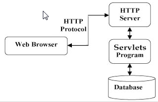
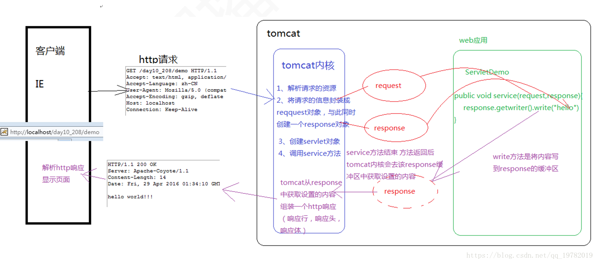

####Servlet（Server Applet）(Java Servlet)
[详解](https://blog.csdn.net/qq_19782019/article/details/80292110)

    用Java编写的服务器端程序，是在服务器上运行的小程序，Servlet对Server就如同Applet对Client一样。
    一个Servlet就是Java编程语言中的一个类，它被用来扩展服务器的性能。
    
    Servlet主要功能在于交互式地浏览和修改数据，生成动态Web内容，这个过程为：
    1) 客户端发送请求至服务器端；
    2) 服务器将请求信息发送至Servlet；
    3) Servlet生成响应内容并将其传给服务器。响应内容动态生成，通常取决于客户端的请求；
    4) 服务器将响应返回给客户端。
   
    
    Servlet接口定义了Servlet与servlet容器之间的契约。
    这个契约是：Servlet容器将Servlet类载入内存，并产生Servlet实例和调用它具体的方法。
    要注意的是，在一个应用程序中，每种Servlet类型只能有一个实例。
    
    Servlet必须符合一定的规范：
    a.必须继承javax.servlet.http.HttpServlet
    b.重写其中的doGet( )或doPost( )方法
    doGet( )    接收并处理所有get提交方式的请求
    doPost( )    接收并处理所有post提交方式的请求
    
    Servlet想要使用，必须配置
    Servlet2.5：web.xml
    Servlet3.0: @Servlet
####Servlet生命周期
    Servlet通过调用 init () 方法进行初始化。
    Servlet调用 service() 方法来处理客户端的请求。
    Servlet通过调用 destroy() 方法终止（结束）。
    最后，Servlet 是由 JVM 的垃圾回收器进行垃圾回收的。
    
    init()被设计成只调用一次，它仅在第一次创建Servlet时被调用。
    Servlet在服务器第一次被请求时被创建，也可以指定Servlet在服务器第一次启动时被加载。
    
    service()方法是执行实际任务的主要方法，service() 方法由Servlet容器调用
    Servlet容器（即Web服务器）调用 service()方法来处理来自客户端（浏览器）的请求，并把格式化的响应写回给客户端。
    每次服务器接收到一个Servlet请求时，服务器会产生一个新的线程并调用service()。
    service()方法检查 HTTP 请求类型（GET、POST、PUT、DELETE 等），并在适当的时候调用 doGet、doPost、doPut、doDelete 等方法。
    在service中使用的编码解码方式默认为：ISO-8859-1编码，response缓冲区的默认编码是iso8859-1
    GET是默认的请求类型
    
    destroy()方法只会被调用一次，在Servlet生命周期结束时被调用。
    destroy()方法可以让 Servlet 关闭数据库连接、停止后台线程、把 Cookie 列表或点击计数器写入到磁盘，并执行其他类似的清理活动。
    在调用destroy()方法之后，Servlet对象被标记为垃圾回收。
    
   
####Servlet工作流程
   
####创建Servlet的三种方式
    ①实现Servlet接口
    ②继承GenericServlet
    ③继承HttpServlet(最常用，一般用这个)
####[Filter过滤器](https://www.runoob.com/servlet/servlet-writing-filters.html)
    Servlet 过滤器可以动态地拦截请求和响应，以变换或使用包含在请求或响应中的信息。
    Filter的执行顺序与在web.xml配置文件中filter-mapping的配置顺序一致，一般把Filter配置在所有的Servlet之前。
####[Servlet异常处理](https://www.runoob.com/servlet/servlet-exception-handling.html)
####Servlet容器(即Web服务器)——Tomcat

####web.xml加载过程
    ①Servlet容器先读取两个节点<listener>和<contex-param>
    ②容器创建一个ServletContext，应用范围内即整个WEB项目
    ③容器读取到<context-param>转化为键值对,存入ServletContext。
    ④容器创建<listener>中的类实例,即创建监听
    ⑤在监听器的contextInitialized方法中从ServletContext获得<context-param>的值，做一些相应的操作
    ⑥容器读取<filter>创建实例。
    以上都是在WEB项目还没有完全启动起来的时候就已经完成了的工作。
    
    总的来说：<context-param>-><listener>-><filter>-><servlet>
    如果web.xml中出现了相同的元素，则按照在配置文件中出现的先后顺序来加载。
    
    Spring web中，WebApplicationContext在监听器ContextLoaderListener的contextInitialized方法中被创建，在contextDestroyed方法中被销毁
####ServletContext
    ServletContext就是一个“域对象”，它存在于整个应用中，并在在整个应用中有且仅有1份，它表示了当前整个应用的
    “状态”，可以理解为某个时刻的ServletContext代表了这个应用在某个时刻的“一张快照”，这张“快照”里面包
    含了有关应用的许多信息，应用的所有组件都可以从ServletContext获取当前应用的状态信息。ServletContext随着程序
    的启动而创建，随着程序的停止而销毁。
####Servlet3.0
    基于注解
    允许动态加载Servlet，需实现ServletContainerInitializer接口
    允许不使用web.xml

