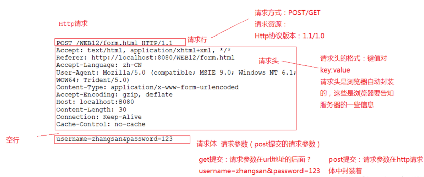
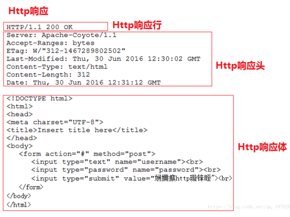

####HTTP
    HTTP是一个无状态的面向连接的协议
####URL
    URL全称是统一资源定位符
    Url的编码格式采用的是ASCII码，所有非ASCII字符均需要编码再传输
####Http请求和Http响应
    Http请求
    <request line>
    <headers>
    <blank line>
    <request-body>
    
    Http响应
    <status line>
    <headers>
    <blank line>
    <response-body>
    
    在响应中唯一真正的区别在于第一行中用状态信息代替了请求信息
    状态行（status line）通过提供一个状态码来说明所请求的资源情况。 

    常用状态码：    
    ◆200 (OK): 找到了该资源，并且一切正常。
    ◆304 (NOT MODIFIED): 该资源在上次请求之后没有任何修改。这通常用于浏览器的缓存机制。
    ◆401 (UNAUTHORIZED): 客户端无权访问该资源。这通常会使得浏览器要求用户输入用户名和密码，以登录到服务器。
    ◆403 (FORBIDDEN): 客户端未能获得授权。这通常是在401之后输入了不正确的用户名或密码。
    ◆404 (NOT FOUND): 在指定的位置不存在所申请的资源。
   
   
   
####[GET和POST的区别](https://blog.csdn.net/gideal_wang/article/details/4316691)
[GET和POST比较](https://www.w3school.com.cn/tags/html_ref_httpmethods.asp)

    GET一般用于获取/查询资源信息，而POST一般用于更新资源信息，这是HTTP规范，但实际做的时候很多人
    没有完全按照这个规范来，很多人贪方便，更新资源时用了GET，因为用POST必须要到FORM（表单），这样会麻烦一点。
    
    GET方法幂等（幂等：对同一URL的多个请求应该返回同样的结果）
    
    在FORM提交中，默认为GET提交。
    
    GET请求示例：
    GET /books/?sex=man&name=Professional HTTP/1.1
    Host: www.wrox.com
    User-Agent: Mozilla/5.0 (Windows; U; Windows NT 5.1; en-US; rv:1.7.6)
    Gecko/20050225 Firefox/1.0.1
    Connection: Keep-Alive
    
    POST请求示例：
    POST / HTTP/1.1
    Host: www.wrox.com
    User-Agent: Mozilla/5.0 (Windows; U; Windows NT 5.1; en-US; rv:1.7.6)
    Gecko/20050225 Firefox/1.0.1
    Content-Type: application/x-www-form-urlencoded
    Content-Length: 40
    Connection: Keep-Alive
    （空行）
    name=Professional%20Ajax&publisher=Wiley
    
    GET提交，请求的数据会附在URL之后，明文；POST提交，把提交的数据放置在是HTTP包的包体(request-body)中
    传输数据大小：HTTP协议没有对传输的数据大小进行限制，HTTP协议规范也没有对URL长度进行限制。
                 GET：特定的浏览器、服务器甚至操作系统对这方面有限制
                 POST：一般服务器会限制
                 通常GET比POST能传输的数据要小很多
    GET和POST请求参数都是键值对
####Restful API
[详解1](https://blog.csdn.net/hjc1984117/article/details/77334616)
[详解2](https://blog.csdn.net/qq_21383435/article/details/80032375)

    REST(Representational State Transfer)，一套支持HTTP规范的新风格
    用HTTP动词（GET,POST,PUT,DELETE)描述操作
    
    统一接口，通过HTTP方法来区分操作：
    GET（SELECT）：从服务器取出资源（一项或多项）。//查
    POST（CREATE）：在服务器新建一个资源，更新资源。//增
    PUT（UPDATE）：在服务器更新资源（客户端提供完整资源数据）。//改
    PATCH（UPDATE）：在服务器更新资源（客户端提供需要修改的资源数据）。//不常用
    DELETE（DELETE）：从服务器删除资源。//删
    
    url中没有动词
####Web服务器
   
####[Cookie与Session](https://blog.csdn.net/fangaoxin/article/details/6952954)
    HTTP协议是无状态的协议。一旦数据交换完毕，客户端与服务器端的连接就会关闭，再次交换数据需要建立新的连接。这就意味着服务器无法从连接上跟踪会话。
    Cookie通过在客户端记录信息确定用户身份，Session通过在服务器端记录信息确定用户身份。
#####Cookie
    Cookie机制用来弥补Http协议无状态的不足，在Seesion出来之前，基本上所有的网站都采用Cookie来跟踪会话。
    Cookie工作原理：给客户端们颁发一个通行证，每人一个，无论谁访问都必须携带自己通行证。这样服务器就能从通行证上确认客户身份了。
    
    Cookie实际上是一小段的文本信息。客户端请求服务器，如果服务器需要记录该用户状态，就使用response向客户端浏览器颁发一个Cookie。
    客户端浏览器会把Cookie保存起来。当浏览器再请求该网站时，浏览器把请求的网址连同该Cookie一同提交给服务器。服务器检查该Cookie，
    以此来辨认用户状态。服务器还可以根据需要修改Cookie的内容。
    
    Cookie功能需要浏览器的支持。不同的浏览器采用不同的方式保存Cookie。
    Cookie分为内存Cookie和硬盘Cookie，其中内存Cookie随浏览器关闭丢失
    
    Cookie对象使用key-value属性对的形式保存用户状态，一个Cookie对象保存一个属性对，一个request或者response同时使用多个Cookie。
    Cookie具有不可跨域名性。
    由于浏览器每次请求服务器都会携带Cookie，因此Cookie内容不宜过多，否则影响速度。Cookie的内容应该少而精。
    Cookie并不提供修改、删除操作。如果要修改某个Cookie，只需要新建一个同名的Cookie，添加到response中覆盖原来的Cookie。
    
    Cookie 通常设置在 HTTP 头信息中
    
    属性maxAge是Cookie失效的时间，单位秒。如果为正数，则该Cookie在maxAge秒之后失效。如果为负数，该Cookie为临时Cookie，
    关闭浏览器即失效，浏览器也不会以任何形式保存该Cookie。如果为0，表示删除该Cookie。默认为–1
#####Session
    理论上，一个用户的所有请求操作都应该属于同一个会话
    Session对象是在客户端第一次请求服务器的时候创建的。
    Session也是一种key-value的属性对
    Servlet中必须使用request来编程式获取HttpSession对象
    各客户的Session彼此独立，互不可见。
    
    Session的使用比Cookie方便，但是过多的Session存储在服务器内存中，会对服务器造成压力。
    服务器一般把Session放在内存里，Session里的信息应该尽量精简
    为防止内存溢出，服务器会把长时间内没有活跃的Session(不活跃用户)从内存删除。这个时间就是Session的超时时间。如果超过了
    超时时间没访问过服务器，Session就自动失效了。
    
    Session保存在服务器，对客户端是透明的，但Session需要使用Cookie作为识别标志，固需要客户端浏览器的支持Cookie
    这是一个名为JSESSIONID的Cookie，它的值为该Session的id,Session依据该Cookie来识别是否为同一用户。
    该Cookie为服务器自动生成的，它的maxAge属性一般为–1，表示仅当前浏览器内有效，并且各浏览器窗口间不共享，关闭浏览器就会失效。
    
    session有一个缺陷：如果web服务器做了负载均衡，那么下一个操作请求到了另一台服务器的时候session会丢失。

    绝大多数的手机浏览器都不支持Cookie。
    URL地址重写是对客户端不支持Cookie的解决方案。将该用户Session的id信息重写到URL地址中，从而跟踪会话。
#### token(令牌)机制
    tokens 是多用户下处理认证的最佳方式。